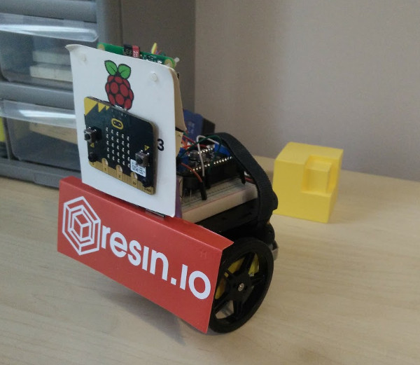

Example of building a Robot OS image for resin.io
=================================================

This project will build a [Robot OS (ROS)](http://www.ros.org/) Kinetic image
and deploy it to a Raspberry Pi using [resin.io](https://resin.io).

The Dockerfile will build a generic ROS Kinetic image and a set of scripts to
perform very simple commands on an Adafruit Bluefruit controlled robot chassis
as described by [Adabox 002](https://www.adafruit.com/adabox002).  However,
the image built is generic and should be usable with any ROS supported
hardware.

To use the Adafruit Bluefruit controller, the Raspberry Pi should be connected
to the appropriate pins on the Bluefruit microcontroller as described in
`catkin_ws/src/resin_robot/scripts/driver.py`.

Happy ROS hacking!

